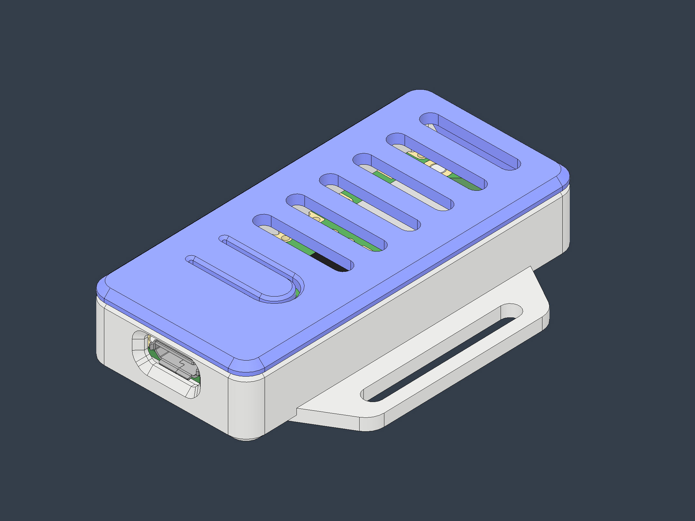

# Case

Two-piece snap-fit enclosure for the Pico. Printable; no screws, glue or fasteners.

## Files

| File | Part |
|---|---|
| `pico-case-top.stl` | Lid, vented |
| `pico-case-bottom.stl` | Base, with mounting tab |
| `pico-case-render.jpg` | Assembly render |

## Attribution and licence

Copyright (c) 2016 Adafruit Industries. MIT — full text in [`LICENSE`](LICENSE).

Source: [`adafruit/Adafruit_CAD_Parts`](https://github.com/adafruit/Adafruit_CAD_Parts), folder
`6252 Pico Case`, commit
[`a1ba008`](https://github.com/adafruit/Adafruit_CAD_Parts/tree/a1ba0089e3090b0abd691572f9d1be44cf39fe64/6252%20Pico%20Case).
Sold by Adafruit as [product 6252](https://www.adafruit.com/product/6252).

The files here are unmodified; only the filenames differ from upstream (`6252 Pico Top.stl`,
`6252 Pico Bottom.stl`, `6252 Pico Case.jpg`).

The STEP and Fusion 360 sources are upstream at the same commit and are not mirrored here — they
embed a full Pico board model, which is neither Adafruit's work nor ours to redistribute. Get them
from the link above to edit the design.

Rooster Wake is not affiliated with Adafruit Industries.

## Fit

Pico, Pico W, Pico 2 and Pico 2 W. Micro USB and the BOOTSEL button are both accessible with the
case closed. The board must be bare — no headers, and nothing soldered to the castellations.

## Print notes

| | Bounding box |
|---|---|
| Lid | 26.0 x 56.0 x 4.2 mm |
| Base | 42.0 x 56.0 x 10.0 mm (26.0 mm across the body; the rest is the mounting tab) |

STL carries no units. Import as **millimetres**.

Adafruit produce it in SLA resin. The snap fit is dimensioned for that process, so FDM prints may
need horizontal expansion trimmed to seat. Neither part has an overhang requiring support when
printed flat on the plate.

Print translucent to keep the Pico's LED readable through the lid slots — the firmware uses it for
status during setup.

We have not test-printed these files.
